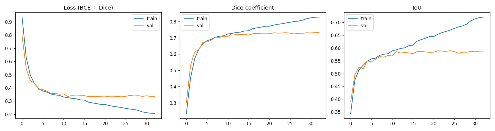
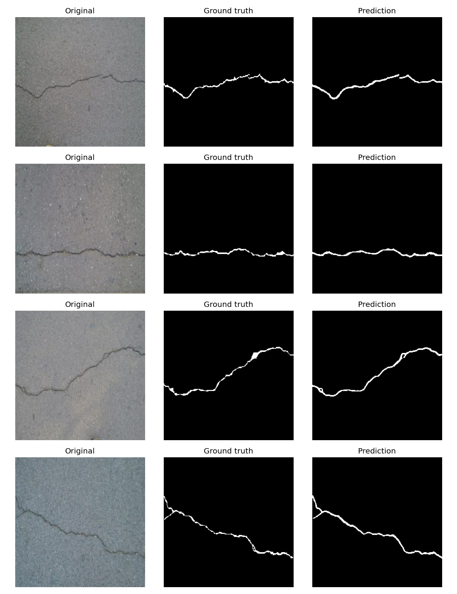

# Concrete Crack Detection

U-Net based semantic segmentation of cracks in concrete surfaces, followed by polynomial modelling of the extracted crack geometry.

## Results

| Metric | Value |
|---|---|
| Dice (images containing cracks) | 0.6830 |
| IoU | 0.5386 |
| Specificity (crack-free images) | 0.7762 |

Metrics are computed with empty masks handled separately, since Dice is undefined for images without cracks.




## Model

Trained U-Net (best epoch 33/33, val_dice_coef = 0.7323) is available under [Releases](../../releases).

## Dataset

Conglomerate Concrete Crack Detection — [link here]

The dataset is not included in this repository. Download it and place it in the
project root as `Conglomerate Concrete Crack Detection/` before running the notebook.

## Repository structure

```
crack_detection.ipynb   # full pipeline: data loading, training, evaluation, curve fitting
outputs/                # figures, metrics, synthetic samples, training history
```
